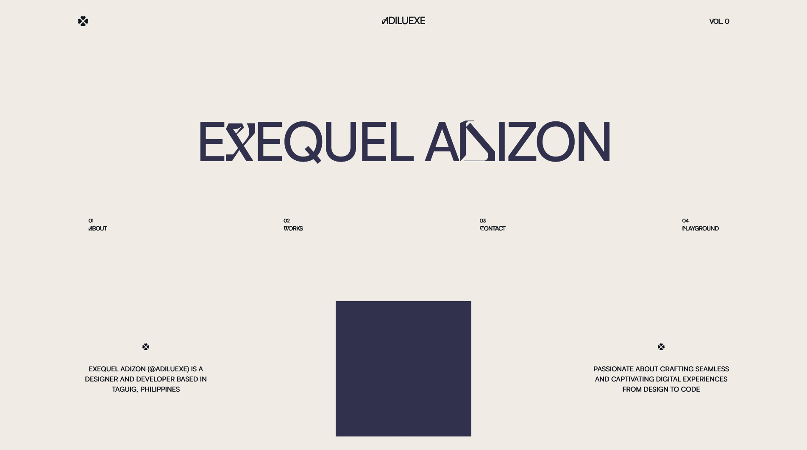

# 🎨 Portfolio Website 2025

A modern, interactive portfolio website showcasing my journey as a creative developer and designer. Built with cutting-edge web technologies and featuring smooth animations, interactive storytelling, and a unique censored content reveal system.



## 🌟 About

This portfolio represents my dual passion for design and development, featuring:

- **Interactive Storytelling**: About page with censored content that reveals on user interaction
- **Liquid Morphing Effects**: Dynamic title animations using GSAP
- **Custom Cursor System**: Smooth cursor following with hover interactions
- **Motion Design Playground**: Showcase of my creative motion graphics work
- **Responsive Project Gallery**: Clean presentation of my development projects

## 🚀 Tech Stack

### **Frontend Framework**

- **Nuxt.js 3** - Vue.js framework for production
- **Vue.js 3** - Progressive JavaScript framework
- **TypeScript** - Type-safe development

### **Styling & UI**

- **Tailwind CSS** - Utility-first CSS framework
- **Custom CSS** - Hand-crafted animations and effects

### **Animations & Interactions**

- **GSAP (GreenSock)** - Professional-grade animation library
- **Custom Cursor System** - Smooth following animations
- **Liquid Morphing Effects** - Advanced text transformations

### **Performance & SEO**

- **Server-Side Rendering (SSR)** - Fast initial page loads
- **SEO Meta Tags** - Optimized for search engines
- **Image Optimization** - Efficient asset loading

### **Development Tools**

- **ESLint** - Code linting and quality
- **Git** - Version control

## ✨ Key Features

### 🎭 Interactive About Page

- Censored content system with highlight reveals
- Toggle between summary and full story modes
- Smooth animations for content transitions

### 🌊 Liquid Morphing Text

- Dynamic title animations on all pages
- Hover-triggered morphing effects
- Elastic and blur transformations

### 🎯 Custom Cursor System

- Global cursor replacement
- Smooth following animations
- Hover state detection and scaling

### 🎬 Motion Graphics Playground

- Video portfolio integration
- Instagram embeds for social media content
- Interactive hover effects

### 💼 Project Showcase

- Categorized project types (Web, Mobile, Game, Web3)
- Circular action buttons for GitHub/Website links
- Hover overlays with project descriptions

## 📁 Project Structure

```
portfolio/
├── assets/                 # Static assets
│   ├── css/               # Global styles
│   ├── fonts/             # Custom fonts (Centrion, Satoshi)
│   └── svg/               # SVG icons
├── components/            # Vue components
│   ├── CustomCursor.vue   # Global cursor system
│   ├── PlaygroundCard.vue # Motion graphics display
│   ├── ProjectCard.vue    # Project showcase cards
│   ├── TheHeader.vue      # Navigation header
│   └── TheNavigation.vue  # Main navigation
├── pages/                 # Route pages
│   ├── about.vue          # Interactive about page
│   ├── contact.vue        # Contact information
│   ├── index.vue          # Homepage with hero
│   ├── playground.vue     # Motion graphics gallery
│   └── works.vue          # Project portfolio
├── plugins/               # Nuxt plugins
│   └── gsap.client.ts     # GSAP configuration
├── public/                # Public assets
│   ├── images/            # Playground images
│   ├── videos/            # Video content
│   └── works/             # Project screenshots
└── nuxt.config.ts         # Nuxt configuration
```

## 🛠 Installation & Setup

```bash
# Clone the repository
git clone https://github.com/adiluexe/portfolio.git

# Navigate to project directory
cd portfolio

# Install dependencies
npm install

# Start development server
npm run dev

# Build for production
npm run build

# Preview production build
npm run preview
```

## 🔧 Development

### Local Development

```bash
npm run dev
```

Access the development server at `http://localhost:3000`

### Build & Deploy

```bash
npm run build
npm run preview
```

## 📋 To-Do List

### 🐛 Bug Fixes

- [ ] Fix mix-blend-difference elements glitching on certain browsers
- [ ] Resolve cursor z-index conflicts with navigation
- [ ] Fix video autoplay issues on mobile Safari
- [ ] Address accessibility concerns with custom cursor

### 📱 Responsiveness Improvements

- [ ] Optimize layout for tablet screens (768px - 1024px)
- [ ] Improve mobile navigation UX
- [ ] Better text scaling on small screens
- [ ] Touch-friendly interactions for mobile

### 🎨 Visual Enhancements

- [ ] Add hero images to About and Home pages
- [ ] Implement dark/light theme toggle
- [ ] Add loading animations between page transitions
- [ ] Create custom 404 error page

### 🗂 Organization & Content

- [ ] Better categorization in Works section
- [ ] Add project filtering by technology/type
- [ ] Implement project detail pages
- [ ] Add case studies for major projects

### ⚡ Performance Optimizations

- [ ] Implement lazy loading for all images
- [ ] Optimize GSAP bundle size
- [ ] Add service worker for offline functionality
- [ ] Implement image compression pipeline

### 🆕 New Features

- [ ] Add blog/articles section
- [ ] Implement contact form with backend
- [ ] Add testimonials section
- [ ] Create downloadable resume functionality
- [ ] Add analytics and tracking
